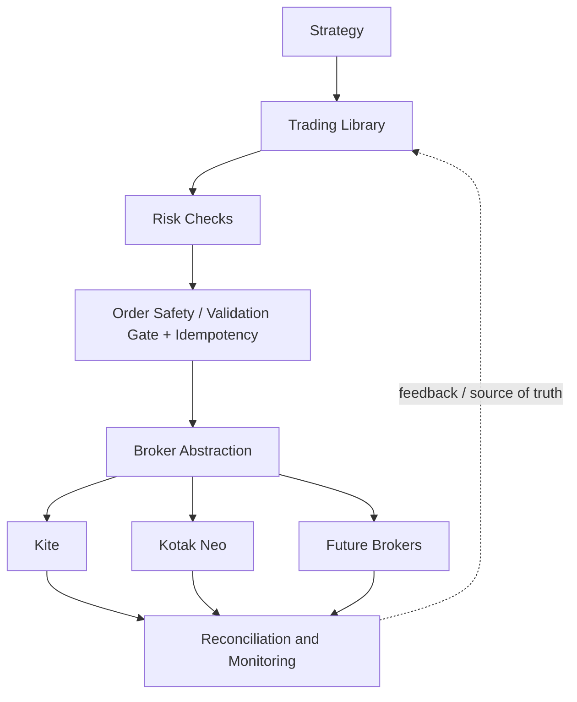
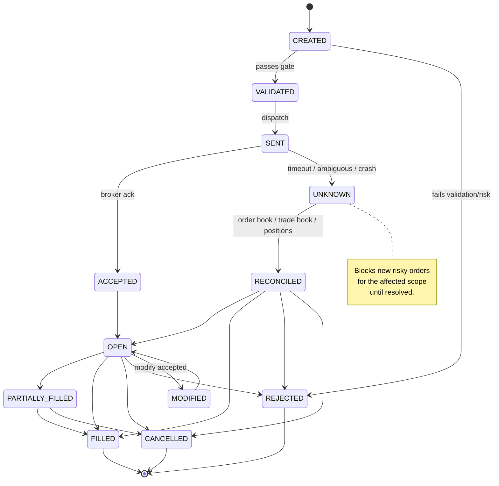

# Architecture Diagrams

Per Spec Law, all diagrams live in a companion; the SPEC.md kernel holds prose only. These illustrate the layering, the order lifecycle state machine (`order-lifecycle.md`), and the hedge-first basket flow (`risk-controls.md`).

## System layering

The library is the execution/safety layer between strategy code and broker APIs.



## Order lifecycle state machine

Backs `order-lifecycle.md` (CAP-5). `UNKNOWN` is the safety sink: any uncertain response routes here and blocks new risky orders until reconciled.



## Hedge-first basket flow

Backs `risk-controls.md` (CAP-8, CAP-9). The short leg is never sent before the hedge is confirmed; a post-sell hedge failure triggers emergency behavior.

```mermaid
flowchart TD
    A[Basket trade requested] --> M{Basket margin OK?\n(where supported)}
    M -- no --> X1[Reject basket / alert]
    M -- yes --> H[Place hedge leg first]
    H --> HR{Hedge filled/accepted?}
    HR -- no --> X2[Do NOT send short sell\nalert]
    HR -- yes --> SS[Place short option sell]
    SS --> SR{Short sell OK?}
    SR -- yes --> DONE[Basket open\ntrack as one logical trade]
    SR -- no --> X3[Roll back / exit hedge\nper basket policy]
    SS -.->|sell ok but hedge later fails| EMG[Immediate alert +\nemergency hedge or exit]
```
